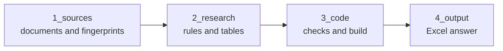

# Welfare crosswalk, dairy cows

Which signs of dairy cow welfare can a machine already measure on farms, and which do certification schemes (the standards behind welfare labels) ask farmers to show? The answer is one Excel file. It lists welfare indicators (measurable signs, such as lameness): the measures in the overview of the Welfare Quality assessment protocol, and the animal based measures (ABMs) that EFSA, the European Food Safety Authority, rates in the ABM assessment tables of its 2023 opinion on dairy cows. It sorts them by a stated rule of thumb for ease of adoption. Every value traces to a public document.

## The question

Kevin Xia put this on his Top 30 list of projects as item 13 ([his text](1_sources/kevin_item_13.md)). He asked for a three way crosswalk for one species: validated welfare indicators, against what commercial farm sensors measure, against what certification schemes require and audit. The most useful results, he wrote, are indicators a sensor already measures but no scheme requires, and indicators a scheme requires but checks by hand.

On a call on 22 September 2026 Kevin proposed a smaller table of indicators that are measurable by AI (artificial intelligence), acceptable to industry and covered by certification schemes. The record of the call is a set of notes written automatically by a meeting tool, not Kevin's own words ([automated call notes](1_sources/kevin_call_2026-09-22.md)). The three part question this project answers, (a) measurable by AI, (b) acceptable to industry and (c) covered by existing sensors or certification schemes, is that proposal as written up in Manisha's smaller scope analysis of 23 September (no longer a file here; it can be read in this repository's history at commit 6384465, file docs/PLF_Smaller_Scope_Analysis_2026-09-23.pdf), which Kevin quotes in his Slack reply of 25 September ([his reply](1_sources/kevin_slack_2026-09-25.md)). In that reply he calls industry acceptability, "covered by existing sensors" and "covered by existing certification schemes" soft factors that make adoption easier, not hard requirements. Item 13 itself has no (a), (b), (c) list. So every indicator stays in, sorted, with each factor visible.

Item 13 names three kinds of source for validated indicators: Welfare Quality, AWIN and the species literature. This project uses Welfare Quality and the EFSA opinion on dairy cows, a choice carried over from the project before it. AWIN is not used for this dairy unit. EFSA rates each of its measures for feasibility, sensitivity and specificity, and some ratings are low. It rates lying time low on feasibility on farm, for example. Since 8 October these ratings are in the table, using EFSA's own level words (high, medium, low), for every indicator that comes from EFSA.

## The answer

The answer is [4_output/welfare_crosswalk_dairy.xlsx](4_output/welfare_crosswalk_dairy.xlsx), in six sheets. **Read me** explains the file and gives the current counts. **Answer** has one row per indicator, sorted by the ease of adoption score, a rule of thumb used only as a sort order and not a recommendation; every factor has its own column. **Sensors x products** sets each indicator against the 129 sensor products listed in a 2021 review by Stygar and colleagues, marking which a published study has tested and which only name it in their own description. **Schemes** sets each indicator against four schemes: RSPCA Assured, FARM version 5 (the US dairy industry's own programme), Global Animal Partnership and Certified Humane. **Product list** is the Stygar list of 129 products as it stood in 2021. Three more products, validated by ICAR (the International Committee for Animal Recording), are not in that list; they are in [2_research/products.csv](2_research/products.csv). **Sources** lists the documents.

Read a row of the Answer sheet from left to right. After the indicator, which source lists it and what kind of thing it measures come EFSA's three ratings, blank for indicators that only Welfare Quality lists. Column (a) says whether a sensor can measure the indicator, and which tested products do. Column (b) gives the cheapest device needed, how many of the 129 products name it, and whether FARM names it. Column (c) gives how many schemes require it and how they check it. The sensor half of (c), covered by existing sensors, is not a separate column: it shows in column (a) and in the count of products that name the indicator. Then come Kevin's two lists, a score from 0 to 15 (a sort order, not a welfare judgement) with its five parts, and finally the documents and pages behind the row.

One pairing can look odd. Device needed can read "Nothing extra" even where column (a) says "Nothing found" for sensors. That happens when the indicator is already taken from milk records or farm records, such as a count of clinical cases, so no new device is needed to have the value.

## Answers so far, as of 8 October 2026

There are 58 indicators: 26 listed only by EFSA (in its 2023 opinion on dairy cows), 26 only by the Welfare Quality protocol, and 6 by both. For the 32 that come from EFSA, the table now also gives EFSA's own ratings of each measure: sensitivity (does it catch the animals that have the problem), specificity (does it avoid flagging animals that do not) and feasibility on farm.

Sensors are checked for 40 of the 58. Of those, 7 have a product in the Stygar list that a published study tested for that measure, 1 is claimed by a product's own description with no validation study recorded, 15 have only research methods or a substitute measure, 12 have nothing in the two sensor sources, and 5 are unclear. The other 18 are not yet checked.

For the 40 checked rows, the cheapest device needed is nothing extra on 7, one device per farm or barn on 17, one device per animal on 8, a sample or a scoring by a person on 1, and no technology named on 7. Across all 58 indicators, this project's coding of what Maroto Molina and colleagues say gives yes (commercially available technology) on 2, partial on 29, no on 2 and not covered on 25.

The four certification schemes have now been read for all 58 indicators. Four readers each read one scheme document in full, which gives 232 scheme rows, one per indicator per scheme. RSPCA Assured requires 21 of the indicators, Global Animal Partnership 18, Certified Humane 13 and FARM 8. Taken together, 25 indicators are required by at least one scheme (5 by all four, 9 by three, 2 by two and 9 by one), and 33 by none. No scheme names sensor data as an accepted way to check any of these indicators. Global Animal Partnership says, in general, that video or other electronic monitoring may replace "certain observations", without naming which. Of the 60 scheme rows that require an indicator, 17 are checked by an inspector looking at the animals or the equipment, 23 by an inspector checking farm records, and on 20 the scheme does not say how.

Kevin's first list, indicators graded Tested or Claimed for sensors that no scheme requires, has 6 indicators: step activity (I008), lying time (I012), subclinical ketosis from milk constituents (I021), subclinical ketosis from beta hydroxybutyrate or ketones (I022), subacute ruminal acidosis from milk constituents (I025) and rumen pH by bolus (I027). Five of them have a product that a published study tested; I022 is claimed only in a product's own description. Three more, walking distance (I009), frequency of lying bouts (I013) and thermal comfort (I039), show unclear, because the rules do not yet settle their sensor evidence. Kevin's second list, indicators a scheme requires but checks by hand, has 22 indicators.

Two indicators stand out. Lameness (I001) and body condition score (I023) are required by all four schemes, and each has a product that a published study tested. All four schemes check lameness by hand. Three check body condition by hand; Certified Humane requires it but does not say how it is checked. So both are on the second list and not on the first, and they share the top score of 13.

These results rest on the 2021 sensor baseline: the products and studies in Stygar and colleagues 2021, and the research methods in Maroto Molina and colleagues 2020. Kevin's change request of 7 October ([his document](1_sources/kevin_change_request_2026-10-07.md)) says this baseline understates what sensors can measure, and so shrinks the first list. That change request is being built, including a dated pass for studies since 2021; until it is done, read the first list as the indicators a 2021 baseline shows. The 18 indicators not yet checked for sensors cannot be on the first list yet, and the order stays provisional until every row is complete.

Some cells are open. [open_questions.md](2_research/open_questions.md) has 12 lines: 5 open on sensor evidence (I006, I009, I013, I020 and I039), 1 closed on 3 October, and 6 open on scheme rows, where the reading rules do not settle whether a requirement names the indicator (cleanliness of udders, I036, for Certified Humane; cleanliness of flank and upper legs, I037, for RSPCA Assured and Certified Humane; cleanliness of lower legs, I038, for RSPCA Assured; and mortality, I048, for Global Animal Partnership and Certified Humane). Such a row is not counted as required. Each of these four indicators is already on the second list through another scheme, so none of the six changes either list.

Every push has been allowed by a PASS row in [audit_log.md](2_research/audit_log.md). The scheme reading of 8 October has not yet been audited: audit_log.md has no row for it yet. The push gate allows a push only when that file has a PASS row for the commit pushed, or for its parent when the push only adds that row. The numbers on this page are updated with each batch of work. The Read me sheet of the Excel file is always current, because a script writes it from the tables.

## What this does not show

The sensor evidence is a baseline from two papers: Stygar and colleagues 2021, and Maroto Molina and colleagues 2020. Their products, studies and web links are as those papers found them. "Nothing found" means no product or method in those two papers, not none anywhere. Newer products and studies are not in the table yet; a dated update pass is planned for later.

"Validated" has a narrow meaning here. It means Stygar record at least one outside study of that product on that measure. It does not mean the product is accurate. Stygar placed every tool for physical condition and health below their high performance threshold.

Eighteen indicators have not been checked for sensors. A factor not yet researched counts 0 points, so the order will change. The schemes were read as written: a scheme counts as requiring an indicator only when a numbered requirement names it and applies to every certified farm, under the fourteen reading rules in [rules.md](2_research/rules.md), rule 4.8. Global Animal Partnership is read at Step 1, the level every certified farm meets.

No review of the table by a welfare scientist is recorded in this repository. The checks described below are by scripts and by an AI agent, not by a person with expertise in animal welfare.

## How it was done

1. **Sources.** Fifteen public documents, each in [manifest.csv](1_sources/manifest.csv) with its link and a fingerprint: a code computed from the file that changes if one character changes.
2. **Rules.** [rules.md](2_research/rules.md) says how every column is filled and scored. It was first fixed on 25 September, before any sensor row was graded; the indicator and product tables were copied from plf-audit. The rules have been changed since, and each change is dated in the change log at the end of rules.md. Some changes moved scores: corrections of 2 October under the farm records rule raised the scores of I020, I024, I028 and I029. I006 was briefly raised on 2 October and returned to farm_fixed on 3 October, because EFSA's definition does not take it from records, so its score is unchanged from the published version.
3. **Tables.** Four tables in [2_research](2_research) hold the research. Each sensor row names the documents behind it, with pages where a passage is cited; rows resting on an absence say what was searched. Each indicator row names the measure as its source names it, and every EFSA row names its EFSA table, but not every indicator row gives a page. Each scheme row says whether the scheme requires the indicator and, where a requirement is quoted, gives its section and page.
4. **Checks.** Scripts check the tables, fingerprints and vendor counts. Before a batch is pushed to GitHub, an AI agent (Claude, a language model, working from a fixed checklist in [.claude/agents/research-auditor.md](.claude/agents/research-auditor.md)) rereads the cited pages and checks each claim. It is a separate session from the one that wrote the rows, but it is not a human reviewer. [audit_log.md](2_research/audit_log.md) lists every version that passed, with what the audit checked and found. After each push the author also plans to read ten rows against the source pages; that spot check is planned and none is logged yet.
5. **Excel.** [build_output.py](3_code/build_output.py) writes the Excel file from the tables. Nothing in it is typed by hand.

## How to check anything yourself

Every value can be checked in one of three ways: read the page the row names, apply the written rule in [rules.md](2_research/rules.md) to what the page says, or count again, by hand in the Stygar spreadsheet or with a script. Cells marked unclear, nothing found or not yet checked say openly what is not known. [2_research/README.md](2_research/README.md) explains the three ways in more detail. Two of the fifteen documents in the manifest, the Stygar paper and its spreadsheet, are in this repository. The others are downloaded from their links. For most of them the fingerprint confirms you have the same file; [1_sources/README.md](1_sources/README.md) gives the exceptions (the ICAR web page and the Wieck essay are checked by a phrase, and the Maroto Molina paper by its text).

## The four folders

- [1_sources](1_sources): the documents, their links and fingerprints, and what Kevin sent, as received.
- [2_research](2_research): the rules, the four tables, the decision log and the audit log.
- [3_code](3_code): the scripts, each with a plain explanation at the top.
- [4_output](4_output): the Excel answer.

## Status, credits and licence

Work in progress. Dairy cows come first. Kevin agreed to broilers, or maybe laying hens, as the second unit. Author Manisha Sarkar. Mentor Kevin Xia. Sentient Futures incubator, 2026. This repository follows on from [github.com/NewAi25/plf-audit](https://github.com/NewAi25/plf-audit), a public repository that is no longer updated.

Data and text written for this repository are licensed CC BY 4.0, and the code is MIT. Source documents keep their owners' terms, and Kevin's words in 1_sources are not covered. See [LICENSE](LICENSE).
